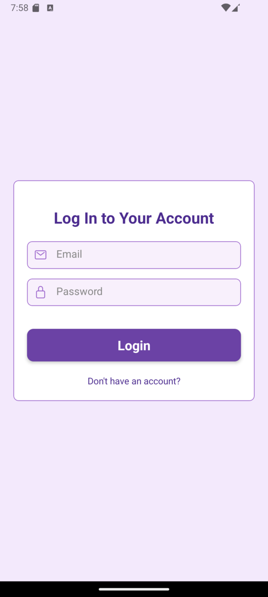
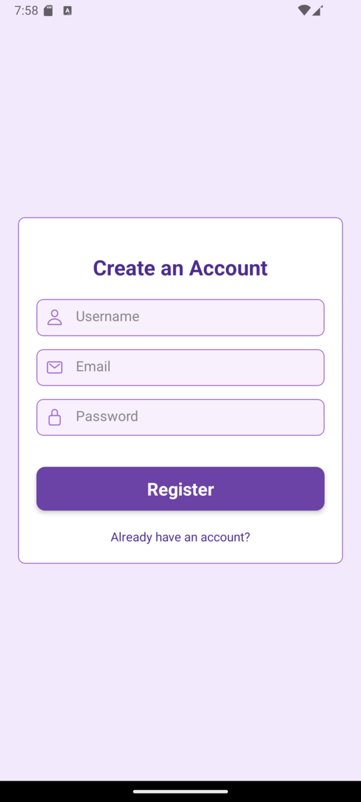
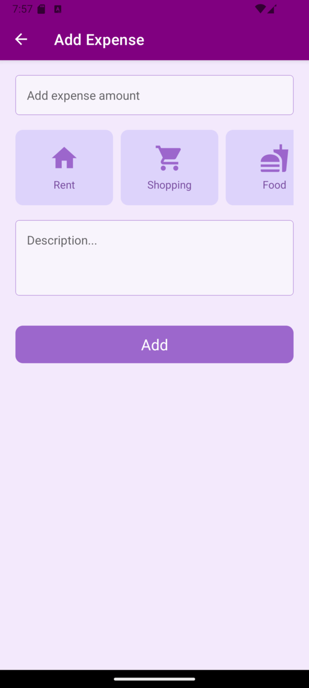
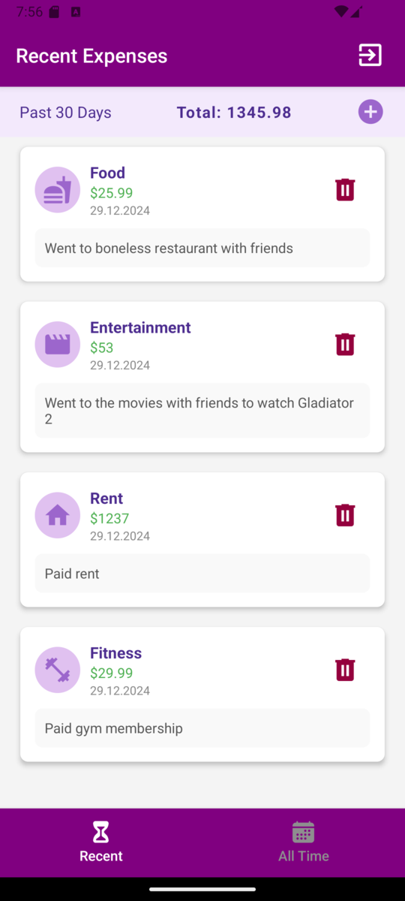
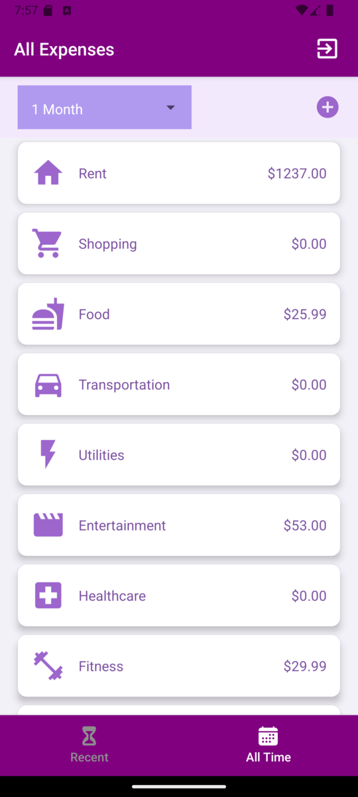

# Expense Tracker App

A mobile app built with React Native for managing expenses and tracking spending habits. Users can register, log in, add expenses, and view their spending history and trends.

## Features

- **Add Expenses**: Users can easily add new expenses with details like amount, category, and description.
- **View Spending Habits**: Track spending habits through the "All Time" view and see trends.
- **Recent Expenses**: Quick view of recently added expenses.
- **Register and Login**: User authentication using Firebase Auth for secure access to the app.
  
## Screenshots

### Login Screen
This is where users can log in using their credentials.

### Register Screen
Allows users to create an account to use the app.

### Add Expense Screen
Here users can add new expenses by filling out the form.

### Recent Expenses Screen
Displays the latest expenses that the user has added.

### All Time Expenses
Shows the total spending over time, providing users with insights into their financial habits.

## Technologies Used

- **React Native**: The core framework for building the mobile app.
- **Redux Toolkit**: For state management across the app.
- **Firebase Auth**: For user authentication and login functionality.
- **Firebase Firestore**: Used to store and manage user data, including expenses and user information.

